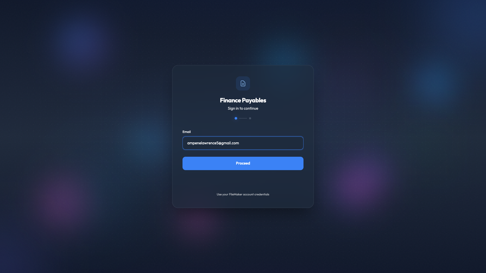
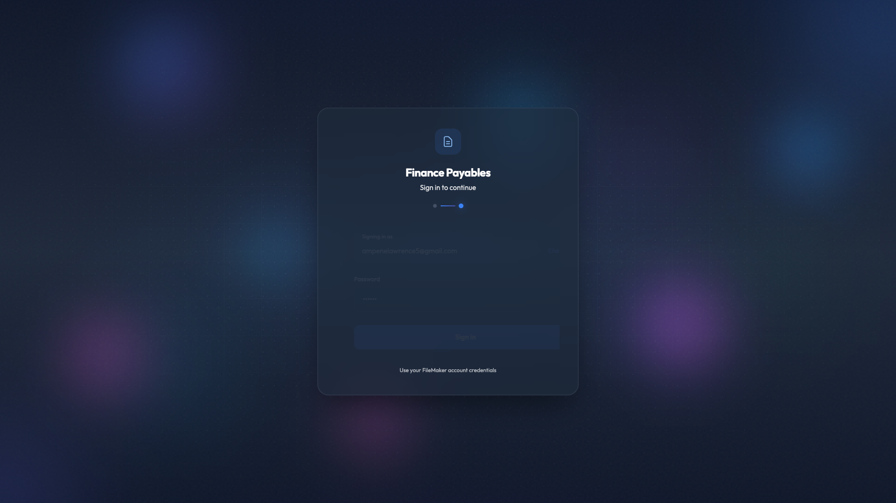
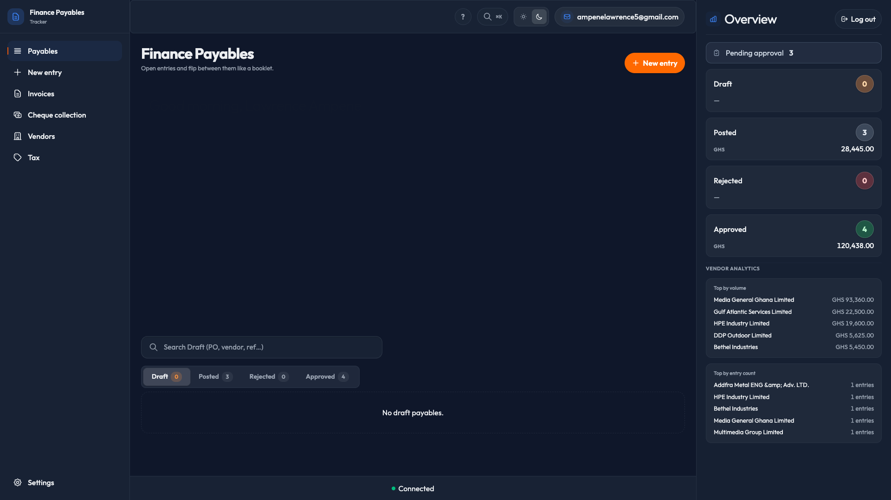
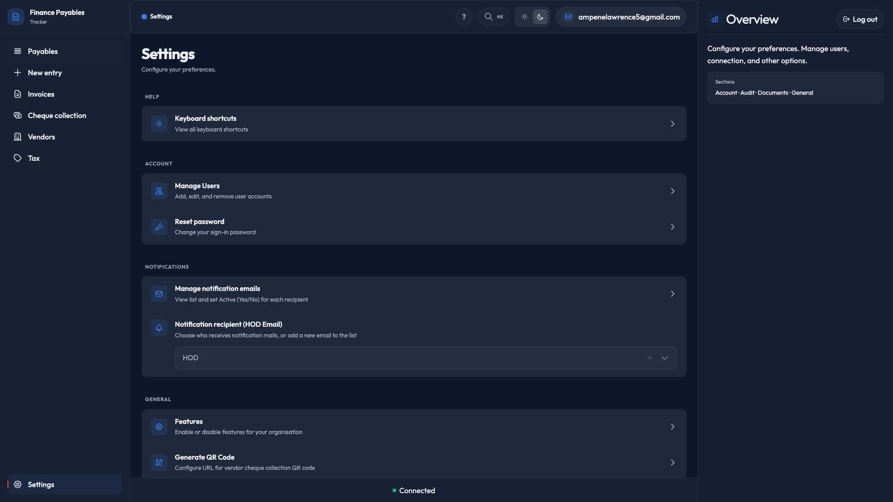
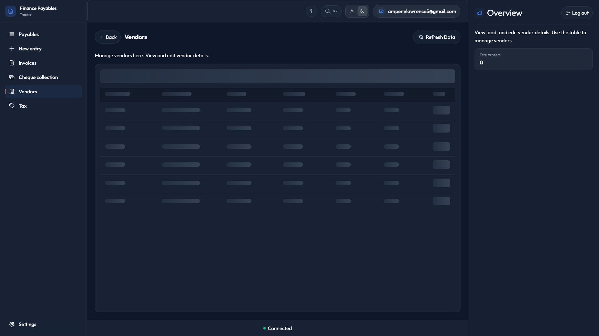
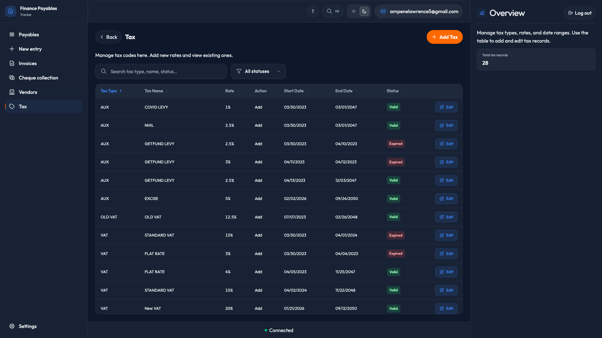

# Finance Payables Tracker — User Manual

## Signing In

### Step 1: Enter your email

1. Open the application in your browser.
2. Enter your email address in the email field.
3. Click **Proceed**.



### Step 2: Enter your password

1. Enter your password in the password field.
2. Click **Sign in**.



### After signing in

You will be redirected to the **Home** (Payables) view.



---

## Main Navigation

Use the sidebar on the left to navigate between sections:

- **Payables** — Home dashboard
- **New entry** — Create a new payable entry (Manager/Admin only)
- **Invoices** — View and manage invoices (Manager/Admin only)
- **Cheque collection** — Collect cheques (if enabled)
- **Vendors** — Manage vendors (if enabled)
- **Tax** — Tax view (if enabled)
- **Settings** — App settings

---

## Settings

Access account and app settings from the sidebar.



---

## Vendors

View and manage vendors (when enabled for your organization).



---

## Tax

View tax-related information (when enabled).



---

## Generating Screenshots

To regenerate the screenshots used in this manual, run:

```bash
npm run test:e2e:docs
```

Ensure the dev server is running and FileMaker is accessible before running.
